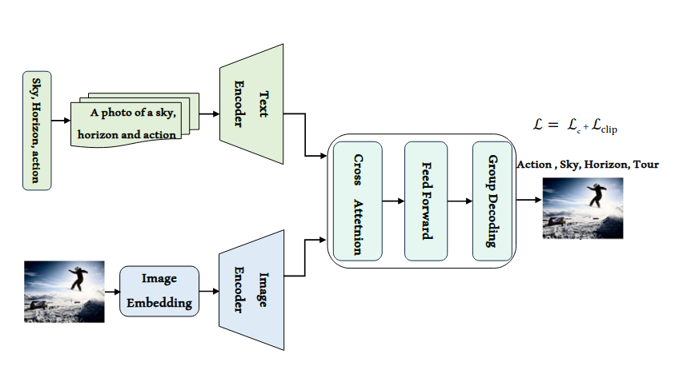
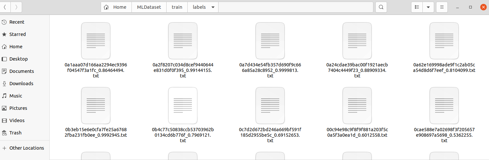
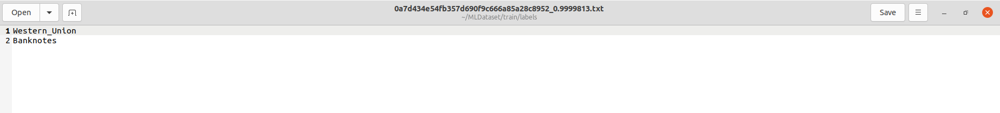
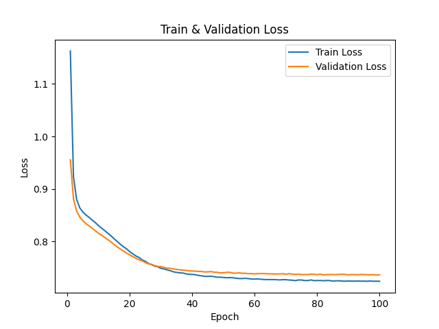
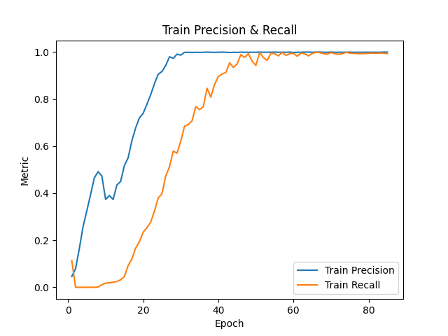
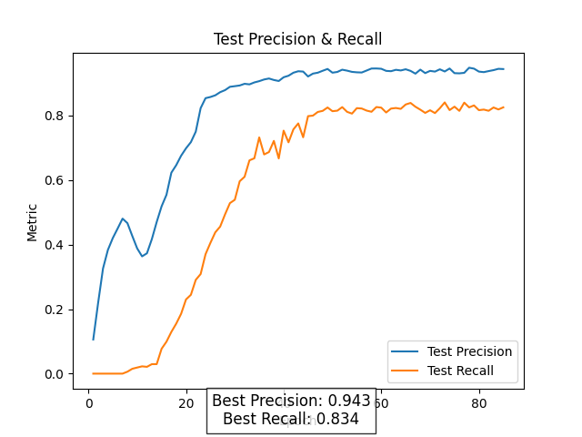

# PyTorch Implementation of the paper "[CLIP-Decoder : ZeroShot Multilabel Classification using Multimodal CLIP Aligned Representations](https://arxiv.org/pdf/2406.14830v1)"

This repo represents the implementation of CLIP-Decoder : ZeroShot Multilabel Classification using Multimodal CLIP Aligned Representations, which is a state-of-the-art solution for multi-label classification task. 



Follow the below steps to train and inference your custom multi-label dataset.

## Setup

Clone this repository in your local:

``` 
git clone https://github.com/YCAyca/CLIP-ML-Decoder.git
```

### Docker (Recommended)

* Option 1

    Pull the already built docker image and start running the code:


    ``` docker pull ycayca/clip_ml_decoder:1.0 ```

* Option 2

    Build the docker image in your local. The Dockerfile is provided in this repository.

    ``` docker build . -t clip_ml_decoder.1.0 ```

For both options, modifty the dataset paths and run docker container:

``` bash run_docker.sh ``` 

### Anaconda

```
conda create --name clip_ml_decoder python=3.7
conda activate clip_ml_decoder
pip install -r requirements.txt
```

## Dataset

Place your multi label dataset in the same directory with yoru main CLIP_ML_Decoder folder. The dataset should have the following structure:

<pre>
MLDataset 
|_train
    |_images
    |_labels
|_test
    |_images
    |_labels
|_classnames.txt
</pre>
Labels folder should include the corresponding .txt file per each image. I.e:






## Train

```
python src/CLIPdecoder.py --dataset_path ../MLDataset --output_path outputs --exp_name v1
```





## Inference

```
python src/inference.py  --checkpoint_path outputs/v1/best_model.pth  --output_path outputs --exp_name inference --classnames ../MLDataset/classnames.txt 
```


